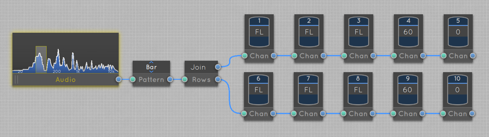

# Luminosus Examples

Examples of how to use Luminosus in combination with a lighting console, especially the ETC Eos series.

**Importing Template Files:** Starting with version 1.2.0 of Luminosus, you can just drag'n'drop the template files to the application window to import them. In version 1.1.1 and below you have to import them manually in the right side menu in the "Projects" tab by clicking on "Import" and selecting the file.

## Index

[Sound2Light: Linear Bar of Lights / Channel Range](#)

[Sound2Light: Multichannel Input](#)

[Sound2Light: Delayed Trigger](#)

[Sound2Light: BPM Detection](#)

[Sound2Light: Trigger Cues](#)

[Sound2Light: Clean Beat Signal](#)

[Sound2Light: Random Color on Beat](#)

---

[MIDI Controller: Map to Fader Bank](#)

---

[Cue List: Adding Notes](#)

[Cue List: Trigger Soundeffect on Cue](#)

[Cue List: Light up MIDI Controller Button with Cue](#)

## Sound2Light

### Linear Bar of Lights / Channel Range

**Goal:** Visualize the volume of the bass frequencies by lighting up one or more lights in a row.

**Notes:** The channels don't have to be consecutive. To light up multiple rows in parallel use the "Join Rows" block as shown in this example. Change the pattern style to "Dot" to only light up one light at the end of the bar.

[Template File](templates/S2L%20-%20Bar%20of%20Lights.lpr) (Right click -> "Save as" to download)

### Multichannel Input

**Goal:** Use multiple indepenent audio inputs to trigger different actions.

**Notes:** TODO

TODO

