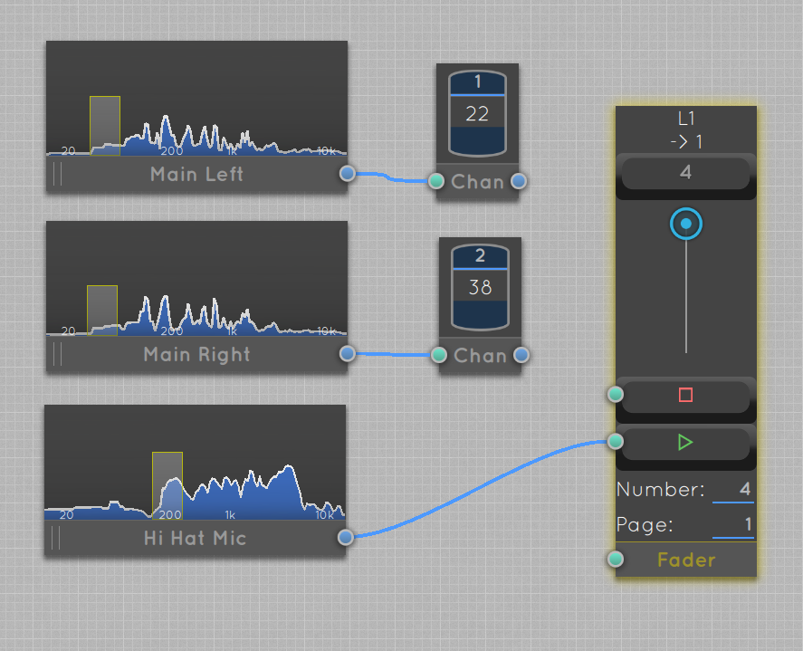
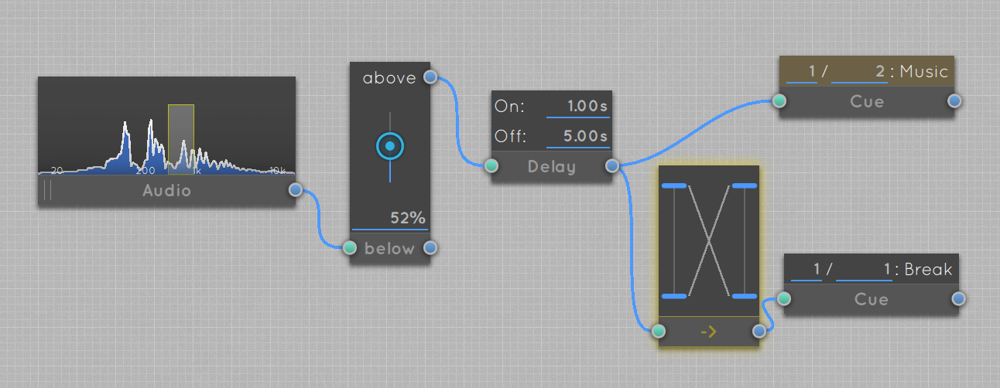

# How to Extend an Eos Console with Luminosus

Examples of how to use Luminosus in combination with a lighting console - especially the ETC Eos series - to create interactive effects and integrate MIDI controllers.

**How to import template files:** Starting with version 1.2.0 of Luminosus, you can just drag'n'drop the template files to the application window to import them. In version 1.1.1 and below you have to import them manually by clicking on "Import" in the "Projects" tab in the right side menu.

## Index

[Sound2Light: Linear Bar of Lights / Channel Range](#linear-bar-of-lights--channel-range)

[Sound2Light: Multichannel Input](#multichannel-input)

[Sound2Light: Delayed Trigger](#delayed-trigger)

[Sound2Light: BPM Detection](#) TODO

[Sound2Light: Trigger Cues](#) TODO

[Sound2Light: Clean Beat Signal](#) TODO

[Sound2Light: Random Color on Beat](#) TODO

---

[MIDI Controller: Map to Fader Bank](#) TODO

---

[Cue List: Adding Notes](#) TODO

[Cue List: Trigger Soundeffect on Cue](#) TODO

[Cue List: Light up MIDI Controller Button with Cue](#) TODO

## Sound2Light

### Linear Bar of Lights / Channel Range

**Goal:** Visualize the volume of the bass frequencies by lighting up one or more lights in a row.

**Tips:** The channels don't have to be consecutive. To light up multiple rows in parallel use the "Join Rows" block as shown in this example. Change the pattern style to "Dot" to only light up one light at the end of the bar.

[Download Template File](templates/S2L%20-%20Bar%20of%20Lights.lpr)

### Multichannel Input

**Goal:** Use multiple indepenent audio inputs to trigger different actions.

In this case two Eos channels are controlled by the main left and right input and a cue list is triggered by the hi-hat microphone.

Another use case could be to trigger cues when the level of the mics reach certain thresholds. With this you could focus a moving light to the person whos speaking at the moment.

**Tips:** This is especially interesting with a digital sound desk used as a multichannel audio interface.

[Download Template File](templates/S2L%20-%20Multichannel.lpr)

### Delayed Trigger

**Goal:** Trigger a "Music" cue when there was music for at least one second and trigger a "Break" cue if the music is away for at least 5.

**Tips:** Don't use the "below" output of the Threshold block for the break cue -> inverting the output of the Delay block ensures that exactly one cue is active at any time.

[Download Template File](templates/S2L%20-%20Music%20and%20Break%20Cues.lpr)

